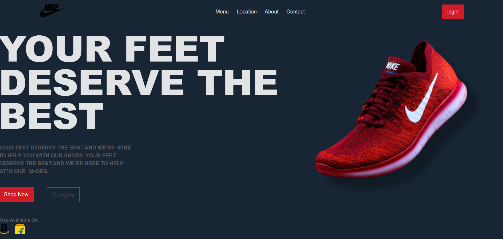

# Brand Page

A sleek, responsive landing page built with React, inspired by the classic Nike brand aesthetic. This project focuses on clean UI design, modular component structure, and smooth CSS animations to create an engaging user experience.

---

## 🚀 Features

* **Responsive Navigation**: A clean header featuring brand branding and intuitive navigation links.
* **Hero Section**: A bold, high-impact landing area designed to grab attention immediately.
* **Smooth Animations**: Includes a custom entrance animation and a continuous "floating" effect for the hero image to add dynamic life to the page.
* **Modular Architecture**: Built using reusable React components for the navigation and hero sections, ensuring the codebase is easy to maintain and scale.
* **Custom Styling**: Utilizes a dark-themed color palette with high-contrast typography for a premium feel.

<p align="center">
  
</p>

---

## 🛠️ Tech Stack

* **Framework**: React.js
* **Styling**: Custom CSS with CSS Variables for consistent theming
* **Typography**: Google Fonts (Poppins & Playfair Display)
* **Build Tool**: Vite

---

## 📂 Project Structure

```text
public/
└── images/               # Local assets (logos and product images)

src/
├── components/
│   ├── Hero.jsx          # Hero section layout and content
│   └── Navigation.jsx    # Header and navigation links
├── App.jsx               # Main application assembly
├── App.css               # Primary styling and animations
├── index.css             # Global styles and resets
└── main.jsx              # Application entry point
```

---

## 🤝 Contributing

Contributions, issues, and feature requests are welcome!
Feel free to check the [issues page](https://github.com/nethmihfernando/Brand-Page/issues).

---